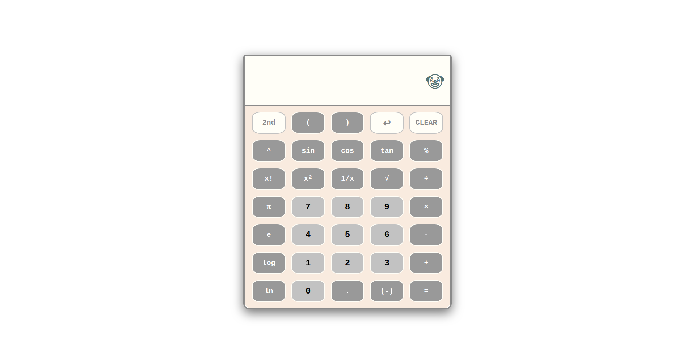

# js-calculator
A webpage implementation of a basic function calculator 

[Live Demo](https://sorrrb.github.io/js-calculator/)

## Demo Preview

### Changelog
6/29/2022 19:40 - complete basic four function calculator 
8/5/2022 18:11 - complete basic scientific calculator

### Languages
- HTML
- CSS
- JavaScript (vanilla - ES6)

### Concepts
- Nested loops
- Document methods
- Callback functions
- Event listeners
- Arrow functions
- Ternary operator
- Manipulating boolean values / undefined values / null
- CSS Grid

## Attribution(s)
Jack Moore - https://www.jacklmoore.com/notes/rounding-in-javascript/
- Very useful article detailing ways to round decimals in Javascript

#### To-Do
~~ - Round-off long decimals ~~ 
~~ - Comma dilineation on numbers >= 1,000 and <= -1,000 ~~ 
~~ - Floating point support ~~ 
~~ - Backspace button support ~~ 
~~ - Keyboard support ~~